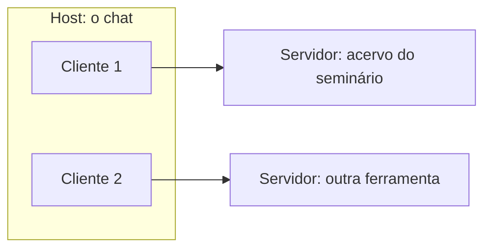
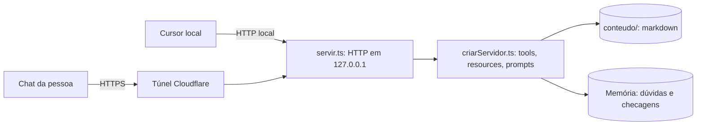

# Acervo MCP

**Manual técnico de instalação e guia de uso**

Um servidor MCP em TypeScript que guarda o material de um seminário e o entrega a qualquer chat compatível.

| | |
|---|---|
| Tecnologia coberta | Model Context Protocol (MCP), especificação 2026-07-28 |
| Pacotes | `@modelcontextprotocol/server` 2.2.0, `@modelcontextprotocol/node` 2.1.0, `zod` 4.6.5 |
| Ambiente testado | Windows, PowerShell, Node.js 24 (mínimo declarado: 20) |
| Edição | 0.2.0 do acervo, rascunho de 01/10/2026 |
| Disciplina | CC05Z, Tópicos em Programação 3, UTFPR, Prof. Diego Antunes |
| Autor | Nicolas Martins de Oliveira (conferir o nome na capa) |

---

## Sobre este manual

**Objetivo.** Deixar uma pessoa de fora instalar o servidor, conectá-lo a um chat, trocar o conteúdo e entender o que cada operação faz.

**Para quem.** Quem programa em JavaScript ou TypeScript e já usou um chat com IA. Não exige conhecer MCP.

**O que você vai construir.**
- um servidor rodando no seu computador, em `http://127.0.0.1:3000/mcp`;
- esse servidor ligado ao Cursor e, se quiser, a um chat de nuvem por um túnel;
- um acervo seu no lugar do acervo de exemplo.

**Como ler as marcas.** Este manual só afirma o que foi feito ou o que o código define. Três marcas:
- **[EXECUTADO]**: comando rodado e saída copiada do registro de testes (`docs/pipeline/p6.md`), em 01/10/2026.
- **[DO CÓDIGO]**: comportamento lido no código-fonte, sem ter sido rodado como exemplo.
- **[NÃO TESTADO]**: aparece onde o passo existe, mas ninguém o rodou ainda.

**Documentação oficial conferida em** 01/10/2026. O MCP muda; a revisão de 28/07/2026 foi uma mudança grande. Confira a especificação antes de copiar daqui para outro projeto.

**Escopo didático.** O acervo e o código servem a um seminário. Não há login, nem persistência em disco das dúvidas, nem controle de acesso.

Histórico de versões: edição única até a entrega; não há tabela.

## Sumário

1. Explicação: o que é o MCP
2. Tutorial: instalação
3. Tutorial: primeiros passos
4. Guia: abrir o servidor para outras pessoas (túnel)
5. Referência: formato do acervo e catálogo de operações
6. Tutorial: o projeto exemplo
7. Guia: testes
8. Fechamento: próximos passos, glossário e referências

---

# 1. Explicação: o que é o MCP

*Tipo: explicação. Não tem comandos.*

## 1.1 O que é

O MCP é um padrão para ligar aplicativos de IA a dados e ferramentas. Sem ele, cada chat precisava de uma ligação própria com cada ferramenta. Com ele, o chat aprende uma linguagem e a ferramenta aprende a mesma linguagem. A imagem é a de uma tomada: o servidor é a tomada e o chat é o aparelho.

As mensagens usam JSON-RPC 2.0 sobre HTTP ou sobre a entrada e a saída padrão de um programa.

## 1.2 Como funciona por dentro

Há três papéis. O **host** é o aplicativo onde a pessoa conversa. O **cliente** é um conector criado pelo host, e cada cliente fala com exatamente um servidor. O **servidor** oferece os dados e as ações. A especificação também diz que um servidor não deve ler a conversa inteira nem enxergar outros servidores.



*Figura 1 — Host, clientes e servidores. Fonte: elaboração própria com base na especificação MCP 2026-07-28 (arquitetura).*

## 1.3 As três peças de um servidor

| Peça | O que é | Quem decide usar |
|---|---|---|
| Tool | Função que o modelo executa | O modelo |
| Resource | Contexto e dados, como um arquivo | A pessoa ou o aplicativo abrem; o modelo pode ler |
| Prompt | Mensagem-modelo pronta, um atalho | A pessoa |

*Tabela 1 — As três peças. Fonte: elaboração própria com base na visão geral da especificação.*

## 1.4 Dois jeitos de usar: local e remoto

| Aspecto | Local (stdio) | Remoto (Streamable HTTP) |
|---|---|---|
| Como liga | O chat inicia o servidor como programa filho | O chat chama um endereço |
| Mensagens | Linhas de texto na entrada e na saída padrão | Cada mensagem é um POST para um endpoint único |
| Precisa de internet | Não | Sim, ou ao menos rede entre os dois |
| Neste manual | Não usado | Usado: local em `127.0.0.1` e público por túnel |

*Tabela 2 — Dois transportes padrão. Fonte: elaboração própria com base na especificação (transportes).*

## 1.5 Quem mantém e por que importa

O MCP foi criado na Anthropic e aberto em 25 de novembro de 2024. Hoje a especificação e os SDKs são mantidos como projeto aberto, com mantenedores que assinam os anúncios de cada revisão. Importa porque é um padrão público: o mesmo servidor serve a chats diferentes.

## 1.6 A revisão de 28/07/2026

A revisão tirou o estado do núcleo do protocolo:
- não há sessão nem o cabeçalho de sessão;
- não há o aperto de mão `initialize`;
- não há retomada de stream: se a resposta quebra, o cliente refaz o pedido;
- cada pedido leva versão do protocolo e capacidades do cliente em `_meta`.

> **Por que isso importa.** Qualquer pedido pode cair em qualquer instância do servidor, como em uma API HTTP comum. Para este projeto, significa que as dúvidas da sala são memória do processo Node, não sessão do protocolo: reiniciar o processo zera a sala.

---

# 2. Tutorial: instalação

*Tipo: tutorial. Do zero até o servidor respondendo.*

## 2.1 Pré-requisitos

| Item | Versão | Observação |
|---|---|---|
| Node.js | 20 ou mais novo (testado com 24) | O `package.json` declara `>=20` |
| npm | o que vem com o Node | |
| PowerShell | o do Windows | Os comandos foram testados no Windows |
| Cursor | qualquer versão recente | Opcional; usado como cliente local |
| `cloudflared` | 2026.9.3, instalado com `winget install Cloudflare.cloudflared` | Só para o capítulo 4 |

O projeto está em um repositório privado do GitHub (`coderunlabz/tp3-mcp`). **[PENDENTE]** O link público entra aqui quando o repositório for aberto.

## 2.2 Instalar as dependências

Na pasta do projeto:

```
npm install
```

**[EXECUTADO]** Saída, em 01/10/2026 (a pasta já tinha `node_modules`):

```
removed 5 packages, and audited 21 packages in 9s
found 0 vulnerabilities
```

## 2.3 Subir o servidor

```
npm start
```

**[EXECUTADO]** Saída (em outra porta, 3001, para não mexer no túnel que estava no ar):

```
local em http://127.0.0.1:3001/mcp
```

Sem mudar a porta, o endereço é `http://127.0.0.1:3000/mcp`.

## 2.4 Verificar

Com o servidor rodando, em outro terminal:

```
npm run verificar
```

**[EXECUTADO]** Saída, em 01/10/2026 (porta 3003):

```
OK
url http://127.0.0.1:3003/mcp
tools checar_entendimento, consultar_acervo, registrar_duvida, sobre_este_acervo, ver_duvidas_da_sala
```

Para ver tools, prompts e resources:

```
npm run listar
```

**[EXECUTADO]** Saída, em 01/10/2026 (porta 3001):

```
tools checar_entendimento, consultar_acervo, registrar_duvida, sobre_este_acervo, ver_duvidas_da_sala
prompts comece-aqui, explica-como-se-eu-tivesse-5-anos, me-guia-na-instalacao, mostra-o-slide, onde-posso-ler-mais, prepara-minha-prova
resources acervo://manual/01-requisitos.md, acervo://manual/02-subir-local.md, acervo://manual/03-tunel.md, acervo://referencias/4sysops-sdk.md, acervo://referencias/blog-2026-07-28.md, acervo://referencias/workos-spec.md, acervo://slides/01-problema.md, acervo://slides/02-ideia.md, acervo://slides/03-arquitetura.md, acervo://slides/04-primitivos.md, acervo://slides/05-evolucao.md, acervo://slides/06-limites.md
```

## 2.5 Erros comuns

Observados durante os testes de 01/10/2026.

| Sintoma | Causa | Como resolver |
|---|---|---|
| O Cursor não mostra as tools | O arquivo `.cursor/mcp.json` sozinho não injeta tools num chat já aberto | Ligar o conector `acervo` em Customize e abrir um chat novo |
| Pedido recusado ao usar o endereço do túnel | O servidor recusa `Host` que não seja local, para evitar ataques de DNS | Usar `npm run tunel` (já libera o endereço) ou colocar o endereço em `HOSTS` |
| O Perplexity mostra erro de registro automático ou de OAuth | O servidor não tem login | No conector, autenticação **None** |
| Página HTML de erro 1033 | O túnel caiu | Ver capítulo 4 |

## 2.6 Fixar versão

O `package.json` fixa as versões exatas dos três pacotes, sem `^`. Não troque por versão mais nova do npm sem refazer os testes do capítulo 7.

## 2.7 Cuidados de segurança

- O servidor escuta só em `127.0.0.1`; quem chega de fora entra pelo túnel.
- Ele recusa `Host` e `Origin` que não estejam na lista (`localhost`, `127.0.0.1`, `[::1]` e o que estiver em `HOSTS`). **[DO CÓDIGO]**
- Não existe senha, token nem chave neste projeto. O arquivo `.env`, se criado, está no `.gitignore`.

---

# 3. Tutorial: primeiros passos

*Tipo: tutorial. Do servidor rodando até a primeira resposta de um chat.*

## 3.1 Conectar o Cursor

O projeto já traz o arquivo de configuração do Cursor:

```json
// .cursor/mcp.json
{
  "mcpServers": {
    "acervo": {
      "url": "http://127.0.0.1:3000/mcp"
    }
  }
}
```

1. Suba o servidor (`npm start`).
2. No Cursor, abra Customize e ligue o conector `acervo`.
3. Abra um chat novo.

**[EXECUTADO]** O Cursor listou as 5 tools do servidor, em 01/10/2026.

## 3.2 Primeiro uso

Quatro pedidos feitos em palavras comuns num chat conectado, em 01/10/2026, e o que aconteceu:

| Pedido | O que o chat fez |
|---|---|
| "O que o acervo diz sobre a revisão de julho?" | Chamou `consultar_acervo` e citou `slides/05-evolucao.md` e as referências |
| "Registra uma dúvida anônima: não entendi o `_meta`" | Gravou a dúvida sem nome |
| "Estou apresentando; mostra as dúvidas da sala" | Mostrou a dúvida, com horário em UTC e assunto `geral` |
| "Explica os primitivos e depois me faz uma checagem" | Explicou com base em `slides/04-primitivos.md` e fez a pergunta, sem mostrar o gabarito |

*Tabela 3 — Primeiros pedidos. Fonte: registro de testes (P5) de 01/10/2026.*

## 3.3 Tarefa e comando

| Tarefa | Comando |
|---|---|
| Subir o servidor local | `npm start` |
| Conferir que responde | `npm run verificar` |
| Listar tools, prompts e resources | `npm run listar` |
| Abrir para outras pessoas | `powershell -File scripts/manter-aberto.ps1` |
| Ver as chamadas | olhar o terminal do servidor |
| Guardar as chamadas em arquivo | definir `LOG_ARQUIVO` antes de `npm start` |
| Rodar as provas de checagem e agrupamento | `npm run prova` |
| Testar com 20 conexões ao mesmo tempo | `npm run carga` |

## 3.4 Variáveis de ambiente

Os scripts leem um arquivo `.env`, se ele existir. Copie `.env.example` e ajuste.

| Variável | Para que serve | Padrão |
|---|---|---|
| `PORT` | Porta do servidor local | 3000 |
| `HOSTS` | Endereços extras aceitos, separados por vírgula | vazio |
| `CONTEUDO` | Pasta do acervo **[DO CÓDIGO]** | `conteudo/` ao lado do código |
| `LOG_ARQUIVO` | Caminho do arquivo de log, uma linha JSON por chamada | vazio (só terminal) |
| `TUNEL_TENTATIVAS` | Quantas vezes tentar subir o túnel depois de uma queda | 8 |
| `TUNEL_PAUSA_MS` | Pausa entre tentativas, em milissegundos | 8000 |

---

# 4. Guia: abrir o servidor para outras pessoas (túnel)

*Tipo: guia prático. Para quem já tem o servidor rodando.*

O servidor escuta só no seu computador. Para um chat de nuvem alcançá-lo, usa-se um **túnel rápido** da Cloudflare, que não precisa de conta nem de domínio. O custo: a Cloudflare não garante que ele fique no ar, e o endereço muda quando ele reinicia.

## 4.1 Passo a passo

1. Pare o `npm start`, se estiver rodando.
2. Abra uma janela própria, fora do Cursor:
   ```
   powershell -File scripts/manter-aberto.ps1
   ```
3. Leia o endereço público, que termina em `/mcp`, no terminal ou em `url-atual.txt` (o arquivo não vai para o git).
4. No chat de nuvem, adicione o endereço como conector remoto, com autenticação **None**.
5. Não reinicie mais nada durante o uso.

## 4.2 Notebook ligado

Para o computador não dormir enquanto está na tomada:

```
powercfg /change standby-timeout-ac 0
powercfg /change hibernate-timeout-ac 0
```

`powercfg /query` confere. Devolva o tempo antigo depois. **[NÃO TESTADO]** O efeito completo na suspensão durante uma aula inteira.

## 4.3 O que o script faz sozinho

- Se o `cloudflared` cair, avisa em letras grandes, espera alguns segundos e sobe de novo, até o limite de tentativas.
- Se o endereço mudar, mostra o antigo e o novo e grava o novo em `url-atual.txt`.
- A cada minuto consulta o próprio endereço público. Se falhar 3 vezes seguidas, mata o `cloudflared` para subir de novo. **[NÃO TESTADO]** Esperar os 3 minutos.

**[EXECUTADO]** Teste de queda, em 01/10/2026, na porta 3004. Só o processo dessa porta foi encerrado:

```
TUNEL CAIU (codigo 4294967295). Reiniciando em 5s. URL rapida pode mudar.
url-atual.txt <- https://simulations-rules-constraints-hitachi.trycloudflare.com/mcp
URL MUDOU. Antes: https://jungle-introductory-fails-probability.trycloudflare.com/mcp
             Agora: https://simulations-rules-constraints-hitachi.trycloudflare.com/mcp
```

> **Atenção.** Reiniciar o processo Node zera as dúvidas da sala. Elas ficam na memória e não vão para disco.

> **Atenção.** Se o endereço mudar, é preciso trocar o endereço no conector de cada chat.

---

# 5. Referência: formato do acervo e catálogo de operações

*Tipo: referência. Consulta, não leitura em sequência.*

## 5.1 Formato dos arquivos do acervo

Cada arquivo é Markdown com cabeçalho (frontmatter) entre `---`. Arquivos sem `tema`, `fonte` e `autor` são ignorados. **[DO CÓDIGO]**

Legenda das colunas: campo · para que serve · obrigatório.

| Campo | Para que serve | Obrigatório |
|---|---|---|
| `tema` | Assunto do arquivo; usado para agrupar dúvidas | Sim |
| `fonte` | De onde veio o conteúdo; volta junto com a resposta | Sim |
| `autor` | Quem escreveu | Sim |
| `palavras` | Sinônimos separados por vírgula que ajudam a agrupar dúvidas | Não |

Pastas e arquivos:

```
conteudo/
  sobre.md          ficha do acervo: titulo, versao, tema, fonte, autor
  slides/NN-titulo.md
  manual/
  referencias/
```

`sobre.md` precisa de `titulo` e `versao` além dos três campos e não é um resource.

Bloco opcional no fim do arquivo, escondido de resources, de buscas e de prompts:

```
:::checagem
pergunta: Quem decide qual tool chamar?
resposta: o modelo
resposta: o llm
:::
```

Cada linha `resposta:` é um gabarito alternativo. A resposta da pessoa vale se casar com algum.

## 5.2 Tools

Todas as tools devolvem texto. Entradas inválidas devolvem uma mensagem de erro em texto. **[DO CÓDIGO]**

### consultar_acervo

*Responde o que o material diz. Nunca completa com conhecimento de fora.*

| Campo | Descrição | Tipo | Obrigatório |
|---|---|---|---|
| `pergunta` | Uma frase | texto | Sim |

**Saída.** Para cada arquivo com palavras da pergunta, uma linha `pasta/arquivo | tema | fonte | autor`, seguida do corpo do arquivo, do que casou mais para o que casou menos. A busca ignora acentos e basta uma palavra útil. Sem resultado: `não consta no acervo`, seguido de `Temas: …`.

| Mensagem | Quando |
|---|---|
| `Informe a pergunta em uma frase.` | Pergunta vazia |
| `Aponte o servidor para uma pasta conteudo/ com markdown (tema, fonte, autor).` | Nenhum arquivo válido na pasta |
| `não consta no acervo` | Nenhuma palavra casou (resultado, não erro) |

### registrar_duvida

*Guarda uma dúvida anônima. É a única tool que grava.*

| Campo | Descrição | Tipo | Obrigatório |
|---|---|---|---|
| `texto` | A dúvida, sem nome | texto | Sim |

**Saída.** `Dúvida registrada sem identificação.` O registro guarda só o texto e o horário em UTC, na memória do processo.

| Mensagem | Quando |
|---|---|
| `Escreva a dúvida em uma frase, sem nome.` | Texto vazio |
| `Dúvida já registrada.` | Texto igual ao da última dúvida, repetido em menos de 5 segundos (evita duplicar quando o cliente repete o pedido depois de uma queda) |

### ver_duvidas_da_sala

*Mostra as dúvidas agrupadas por assunto. Pensada para quem está apresentando.*

Sem campos de entrada.

**Saída.** Um bloco por assunto, com `- horário texto` por dúvida. O assunto é o `tema` do arquivo com mais palavras em comum com a dúvida; sem palavra em comum, `geral`. A comparação usa o `tema`, o `palavras` e o corpo do arquivo.

| Mensagem | Quando |
|---|---|
| `A sala ainda não registrou dúvida.` | Nenhuma dúvida na memória |

### checar_entendimento

*Faz uma pergunta e confere a resposta, sem devolver o gabarito.*

| Campo | Descrição | Tipo | Obrigatório |
|---|---|---|---|
| `id` | Identificador devolvido na primeira chamada | texto | Não |
| `resposta` | O que a pessoa respondeu | texto | Não |

**Uso em duas chamadas.** Sem campos: devolve `<id>` e a pergunta. Com `id` e `resposta`: devolve `certo` ou `errado` seguido de `Releia pasta/arquivo`.

**Regra de acerto.** A resposta e o gabarito são comparados sem acento e sem diferença de maiúscula. Se a resposta tiver negacao (`não`, `nunca`) e o gabarito não, é errada. Se o gabarito tiver só uma palavra útil, a resposta precisa ser só essa palavra (por exemplo, "o modelo" vale; "a pessoa escolhe o modelo" não). Se tiver mais de uma, a resposta precisa conter todas.

| Mensagem | Quando |
|---|---|
| `Chame de novo sem resposta para receber uma pergunta.` | `resposta` sem `id` |
| `Essa checagem expirou. Peça outra pergunta.` | `id` desconhecido (por exemplo, depois de reiniciar o servidor) |
| `O acervo não tem pergunta de checagem.` | Nenhum arquivo com bloco `:::checagem` |

### sobre_este_acervo

*Diz o que está carregado.*

Sem campos de entrada.

**Saída.** Título, versão, autor, fonte, lista dos arquivos (`pasta/arquivo | tema`) e a lista dos seis atalhos.

| Mensagem | Quando |
|---|---|
| `Falta conteudo/sobre.md com titulo e versao.` | Ficha ausente ou incompleta |

## 5.3 Resources

Três famílias, todas com tipo `text/markdown`:

| Endereço | O que é |
|---|---|
| `acervo://slides/{arquivo}` | Um slide |
| `acervo://manual/{arquivo}` | Um passo do manual |
| `acervo://referencias/{arquivo}` | Uma referência |

O texto devolvido não traz o cabeçalho nem o bloco `:::checagem`. Um caminho que saía da pasta ou que não exista devolve `Esse arquivo não está no acervo.` **[DO CÓDIGO]**

## 5.4 Prompts (atalhos)

Os nomes no protocolo não têm barra. Cada atalho vira uma mensagem pronta para o chat.

| Nome | Argumento | O que pede ao chat |
|---|---|---|
| `comece-aqui` | nenhum | Explicar o que é o acervo e listar os outros atalhos |
| `explica-como-se-eu-tivesse-5-anos` | `assunto` (texto, opcional) | Explicar com uma analogia, só com o que o acervo diz |
| `mostra-o-slide` | `numero` (número) | Apresentar o slide N em voz de apresentação |
| `me-guia-na-instalacao` | `passo` (número, opcional) | Mostrar um passo do manual por vez |
| `prepara-minha-prova` | `foco` (texto, opcional) | Montar um estudo curto e fazer a checagem |
| `onde-posso-ler-mais` | `assunto` (texto, opcional) | Listar as referências do acervo |

**[EXECUTADO]** `getPrompt` respondeu para `comece-aqui`, `me-guia-na-instalacao`, `prepara-minha-prova`, `onde-posso-ler-mais` e `explica-como-se-eu-tivesse-5-anos`, todos sem argumentos, no cliente oficial.

> **Atenção. [PENDENTE]** `mostra-o-slide` e `me-guia-na-instalacao` pedem um *número*, mas o protocolo envia argumentos de prompt como *texto*. A chamada com argumento não foi testada, e pode ser recusada. A correção é aceitar o texto e converter para número. Se algum chat não mostrar a lista de atalhos, peça em palavras: o chat usa as mesmas tools.

## 5.5 Descoberta e cache

O servidor implementa `server/discover`, obrigatório na revisão 2026-07-28.

**[EXECUTADO]** Com o cliente oficial fixado em `2026-07-28`, em 01/10/2026: `discover` devolve `supportedVersions: ["2026-07-28"]`, `ttlMs: 0`, `cacheScope: "private"` e `serverInfo` `acervo@0.1.0`. As listas de tools e resources e a leitura de resource trazem `ttlMs` e `cacheScope` (0 e `private`). Sem fixar a versão, o cliente oficial usa a era 2025-11-25 e não chama `server/discover`.

## 5.6 Log de chamadas

Cada chamada MCP imprime uma linha no terminal: horário, cliente com versão, método, alvo (nome da tool, do prompt ou endereço do resource), `ok` ou `erro` e o tempo. Não grava IP nem o texto da pergunta. Com `LOG_ARQUIVO`, também escreve uma linha JSON por chamada.

**[EXECUTADO]** Com dois clientes de teste, o log mostrou `demo-claude@0.1.0` e `demo-perplexity@0.2.0` na chamada `initialize`. Os pedidos seguintes do cliente oficial apareceram como `node@-`, porque o nome do cliente chega no primeiro contato. Como Claude e Perplexity aparecem de verdade **[NÃO TESTADO]**.

---

# 6. Tutorial: o projeto exemplo

*Tipo: tutorial. Entender o acervo do seminário e trocar pelo seu.*

## 6.1 Requisitos e decisões

| Decisão | Motivo |
|---|---|
| Sem cliente próprio; qualquer chat compatível serve | Mostrar que o servidor não depende de um aplicativo |
| Sem dado de pessoa | Nome, IP e conteúdo da pergunta ficam fora do registro |
| Dúvidas só em memória | Privacidade da turma; sem arquivo para vazar |
| Gabarito não volta para o modelo | O chat não pode entregar a resposta antes da pessoa tentar |
| Túnel rápido | Não exige conta nem domínio; o custo é o endereço mudar |
| Sem interface HTML (MCP Apps) | O chat da turma pode não ter suporte |

## 6.2 Arquitetura do exemplo



*Figura 2 — Arquitetura do exemplo. Fonte: elaboração própria com base no código do projeto.*

## 6.3 Árvore de diretórios

```
tp3-mcp/
  src/
    index.ts           liga o servidor
    servir.ts          HTTP, validação de Host e Origin, log
    criarServidor.ts   tools, resources, prompts, memória
    logChamada.ts      linha de log sem IP
  scripts/             túnel, listar, verificar, provas
  conteudo/            o acervo (trocável)
  docs/                plano, estado, testes, fontes
  .cursor/mcp.json     conector local do Cursor
  .env.example         variáveis
```

## 6.4 O código, em blocos

**Ler um arquivo do acervo.** Separa o cabeçalho, o corpo e o bloco de checagem:

```ts
// src/criarServidor.ts — separar (trecho)
const textoNormalizado = markdown.replace(/\r\n/g, '\n');
const fim = textoNormalizado.startsWith('---\n') ? textoNormalizado.indexOf('\n---\n', 4) : -1;
const meta = fim === -1 ? '' : textoNormalizado.slice(4, fim);
```

O cabeçalho está entre dois traços `---`. Tudo antes do segundo marcador é metadado; o resto é corpo. Depois disso a função corta o bloco `:::checagem` do corpo, para ele não voltar ao chat.

**Buscar por palavras.** Conta quantas palavras da pergunta aparecem em cada arquivo:

```ts
// src/criarServidor.ts — acharTrechos (trecho)
const termos = termosDaPergunta(pergunta);
return arquivos
    .map(arquivo => {
        const visivel = normalizar(`${arquivo.tema}\n${arquivo.corpo}`);
        const acertos = termos.filter(termo => visivel.includes(termo)).length;
        return { arquivo, acertos };
    })
    .filter(item => item.acertos > 0)
    .sort((a, b) => b.acertos - a.acertos)
```

Primeiro tira acentos e palavras vazias ("de", "o", "como"). Depois, para cada arquivo, conta as palavras que aparecem e ordena do que mais casou para o que menos casou. Quem não casou nenhuma sai da lista.

**Registrar uma dúvida.** A única tool que grava:

```ts
// src/criarServidor.ts — registrar_duvida (trecho)
const ultima = duvidas.at(-1);
if (ultima && ultima.texto === duvida.trim() && agora - Date.parse(ultima.horario) < 5000) {
    return texto('Dúvida já registrada.');
}
duvidas.push({ texto: duvida.trim(), horario: new Date(agora).toISOString() });
```

A dúvida vai para uma lista na memória, só com texto e horário. Repetir o mesmo texto em menos de 5 segundos não duplica, o que protege contra pedidos repetidos depois de uma queda de rede.

**Servir pela rede.** Liga o servidor MCP ao HTTP:

```ts
// src/servir.ts — servir (trecho)
const mcp = createMcpHandler(() => criarServidor(pasta));
```

O `createMcpHandler`, do pacote `@modelcontextprotocol/server`, atende cada pedido HTTP criando um servidor novo a partir da pasta do acervo. Não há sessão entre um pedido e o seguinte.

## 6.5 Operações do exemplo e respostas esperadas

| Pedido ao chat | Operação | Resposta esperada |
|---|---|---|
| "O que o acervo diz sobre a revisão de julho?" | `consultar_acervo` | Trecho de `slides/05-evolucao.md` com fonte |
| "O que o acervo diz sobre churrasco?" | `consultar_acervo` | `não consta no acervo` e a lista de temas |
| "Registra uma dúvida anônima: o que é host?" | `registrar_duvida` | `Dúvida registrada sem identificação.` |
| "Estou apresentando; mostra as dúvidas" | `ver_duvidas_da_sala` | Assunto `arquitetura` com a dúvida |
| "Me faz uma checagem" | `checar_entendimento` | Uma pergunta, sem gabarito |

*Tabela 4 — Operações do exemplo. Fonte: registro de testes de 01/10/2026 e código do projeto.*

## 6.6 Executar localmente

Ver capítulo 2. A saída esperada está em 2.3 e 2.4.

## 6.7 Trocar o acervo pelo seu

1. Crie uma pasta com `sobre.md`, `slides/`, `manual/` e `referencias/`. Cada arquivo precisa de `tema`, `fonte` e `autor`.
2. Aponte o servidor para ela: `$env:CONTEUDO="C:\caminho\minha-pasta"`.
3. Suba com `npm start` e confira com `npm run verificar` e `npm run listar`.

**[NÃO TESTADO]** O servidor nunca foi rodado com o acervo de outra pessoa; o passo a passo vem do código.

---

# 7. Guia: testes

*Tipo: guia prático.*

## 7.1 Testes feitos em 01/10/2026

| Teste | Comando | Resultado |
|---|---|---|
| Servidor responde | `npm run verificar` | `OK`, com as 5 tools |
| Lista tudo | `npm run listar` | 5 tools, 6 prompts, 12 resources |
| Checagem: resposta certa curta | cliente oficial | `certo` |
| Checagem: negação ("o modelo nao decide") | `npm run prova` | `errado` |
| Checagem: paráfrase ("o custo de integrar cada chat a cada ferramenta, o N vezes M") | cliente oficial | `certo` |
| Checagem: "a pessoa escolhe o modelo" | `npm run prova` | `errado` |
| Checagem: "o modelo" | `npm run prova` | `certo` |
| Agrupamento: "nao entendi o _meta" | cliente oficial | `evolucao` |
| Agrupamento: "o que e host?" | cliente oficial | `arquitetura` |
| 20 conexões ao mesmo tempo | `npm run carga` | `total=20 falhas=0` (no computador local, sem túnel) |
| Queda do túnel | matar o `cloudflared` | Aviso, reinício, endereço novo e `url-atual.txt` atualizado |
| `server/discover` e cache | cliente oficial fixado | Ver 5.5 |
| Log de dois clientes | cliente oficial | Ver 5.6 |

*Tabela 5 — Testes. Fonte: `docs/pipeline/p6.md`.*

## 7.2 O que não foi testado

- Reiniciar o computador e ver o túnel e o servidor no ar sem abrir nada.
- A lista de atalhos nos chats de nuvem (Claude, Perplexity, ChatGPT).
- Os atalhos `mostra-o-slide` e `me-guia-na-instalacao` com argumento.
- A rede da UTFPR.
- A verificação pública de 3 minutos que reinicia o túnel.
- Fechar o Cursor e ver o túnel seguir de pé.
- O acervo de outra pessoa no lugar do exemplo.
- Carga com vários chats reais pelo túnel.
- A demo cronometrada.

## 7.3 O que testar em seguida

Os itens de 7.2, nessa ordem de importância: atalhos com argumento, atalhos nos chats, rede da UTFPR, acervo de outra pessoa.

---

# 8. Fechamento

## 8.1 Próximos passos

| Área | O que aprofundar |
|---|---|
| Autenticação | A revisão de 2026 moveu o registro de cliente para documentos de metadados e deprecia o registro dinâmico |
| Operação | Túnel nomeado da Cloudflare, ou outro endereço fixo |
| Idempotência | Chave para tools que gravam, já que um stream quebrado não se retoma |
| Interface | A extensão MCP Apps, se o chat suportar |

**Quando usar este servidor:** para entregar material e coletar dúvidas numa aula ou oficina. **Quando não usar:** onde seja preciso login, auditoria ou guardar dados de pessoas.

## 8.2 Glossário

| Termo | Significado |
|---|---|
| MCP | Model Context Protocol, padrão aberto para ligar chats a ferramentas |
| Host | O aplicativo onde a pessoa conversa |
| Cliente | O conector que o host cria; fala com um servidor |
| Servidor | Quem oferece tools, resources e prompts |
| Tool | Ação que o modelo decide chamar |
| Resource | Arquivo ou dado que o aplicativo ou a pessoa abre |
| Prompt | Atalho pronto que a pessoa escolhe |
| stdio | Transporte local: entrada e saída padrão de um programa |
| Streamable HTTP | Transporte remoto: cada mensagem é um POST HTTP |
| Túnel | Programa que dá um endereço público a um servidor local |
| `_meta` | Campo de cada pedido com versão, capacidades e identificação do cliente |
| Frontmatter | Cabeçalho de metadados entre `---` no início de um arquivo Markdown |

## 8.3 Referências

ANTHROPIC. **Introducing the Model Context Protocol.** [S. l.]: Anthropic, 25 nov. 2024. Disponível em: https://www.anthropic.com/news/model-context-protocol. Acesso em: 1 out. 2026.

MODEL CONTEXT PROTOCOL. **Specification 2026-07-28.** [S. l.]: Model Context Protocol, 2026. Disponível em: https://modelcontextprotocol.io/specification/2026-07-28. Acesso em: 1 out. 2026.

SORIA PARRA, David; DELIMARSKY, Den. **The 2026-07-28 Specification.** [S. l.]: Model Context Protocol Blog, 28 jul. 2026. Disponível em: https://blog.modelcontextprotocol.io/posts/2026-07-28/. Acesso em: 1 out. 2026.

SORIA PARRA, David; DELIMARSKY, Den. **The 2026-07-28 MCP Specification Release Candidate.** [S. l.]: Model Context Protocol Blog, 21 maio 2026. Disponível em: https://blog.modelcontextprotocol.io/posts/2026-07-28-release-candidate/. Acesso em: 1 out. 2026.

WEINBERGER, Felix; ISBEY, Max; DELIMARSKY, Den. **Beta SDKs for the 2026-07-28 MCP Spec Release Candidate Are Here.** [S. l.]: Model Context Protocol Blog, 29 jun. 2026. Disponível em: https://blog.modelcontextprotocol.io/posts/sdk-betas-2026-07-28/. Acesso em: 1 out. 2026.

PAKTITI, Maria. **MCP went stateless: What changed in the 2026-07-28 spec.** [S. l.]: WorkOS, 16 set. 2026. Disponível em: https://workos.com/blog/mcp-stateless-spec-2026-07-28. Acesso em: 1 out. 2026.

## 8.4 Marcas e uso didático

MCP, Cursor, Claude, Perplexity, ChatGPT, Cloudflare, Node.js e npm são marcas de seus respectivos donos, citadas aqui só para identificar as ferramentas. O código deste projeto tem finalidade didática.
